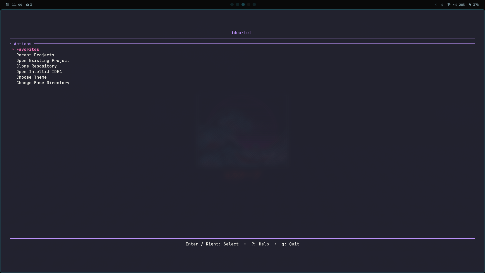

# idea-tui 🚀

A high-performance, minimalist terminal-based project manager and launcher for IntelliJ IDEA Ultimate Edition.

## ✨ Features

- **📂 Structured Project Browser**: Navigate through your projects by category (defaults to `~/dev`).
- **🎨 11 Beautiful Themes**: Choose between **Darcula (default)**, Catppuccin, Nord, Tokyo Night, Gruvbox, and more.
- **🛡️ Startup Validation**: Automatically checks if your project and IntelliJ paths are valid on launch.
- **⭐️ Favorites**: Mark your most important projects for instant access.
- **🕒 Recently Opened**: Tracks and lists your last 10 opened projects.
- **🔍 Smart Search**: Press `/` to filter any list instantly.
- **🌿 Real-time Git Status**: See current branch (``), clean status (``), and pending changes (``).
- **🖥️ Quick Terminal**: Press `t` to open your preferred terminal in the project's directory.
- **⚙️ Fully Configurable**: Customize paths, terminal commands, and themes via a TOML config.

## 📸 Screenshots



## 🛠️ Prerequisites

1.  **IntelliJ IDEA Ultimate**: Ensure it's installed. The app will check both `/opt` and your system PATH.
2.  **Nerd Fonts**: Required for icons (``, ``, ``, etc.).
3.  **GitHub CLI (Optional)**: For seamless repo cloning:
    ```bash
    # Example for Arch Linux
    sudo pacman -S github-cli
    gh auth login
    ```

## 🚀 Installation

### ⚡ Fastest Way (requires Rust)
Install directly from GitHub:
```bash
cargo install --git https://github.com/fabian-berencreutz/idea-tui.git
```
This will build and place the `idea-tui` binary in your `~/.cargo/bin/` folder (ensure this is in your PATH).

### 🛠️ Manual Build
If you prefer to build it from source:
1.  **Clone this repository**:
    ```bash
    git clone https://github.com/fabian-berencreutz/idea-tui.git
    cd idea-tui
    ```
2.  **Build and install**:
    ```bash
    cargo install --path .
    ```
    *(This is cleaner than `cargo build --release` as it handles the binary placement for you)*.

## ⌨️ Shortcuts

| Key | Action |
| :--- | :--- |
| **Arrows / hjkl** | Navigate menus and lists |
| **Enter / l** | Select / Enter / Trigger Open |
| **Backspace / h** | Go back / Cancel |
| **/** | Start search (Press **Enter** to browse results) |
| **f** | Toggle Favorite |
| **t** | Open Quick Terminal |
| **r** | Refresh Git Status / View |
| **?** | Toggle Help Screen |
| **q** | Quit |
| **Esc** | Clear Search / Main Menu / Close Popups |

## ⚙️ Configuration

On first run, `idea-tui` creates a configuration file at:
`~/.config/idea-tui/default-config.toml`

> [!IMPORTANT]
> **You must ensure `idea_path` points to your actual IntelliJ executable.**
> If you can launch IntelliJ from your terminal by typing `idea`, you can find the correct path by running:
> ```bash
> which idea
> ```

```toml
base_dir = "/home/user/dev"
idea_path = "/usr/bin/idea"           # Update this to your 'which idea' output
terminal_command = "kitty --directory" # Command to launch terminal
theme = "Darcula (default)"            # Choose from 11 available themes
```

## 🎨 Themes

Available themes:
`Darcula (default)`, `Catppuccin Mocha`, `Dracula`, `Gruvbox`, `Nord`, `Solarized Dark`, `One Dark`, `Tokyo Night`, `Everforest`, `Rose Pine`, `Ayu Mirage`.

## 🧪 Development

This project is built with **Rust** and follows a modular architecture:
- `app.rs`: State management and business logic.
- `ui.rs`: TUI rendering and layout.
- `models.rs`: Data structures and configuration.
- `theme.rs`: Color definitions.
